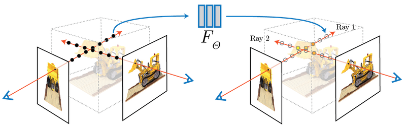

# NeRF
Collection of resources around NeRF. From total noob to recently released papers.

This repo aims at giving a view of all actors and technics around NeRF: papers, repo, people, companies, etc 
PR accepted!
## Collections / curated lists

A curated list of awesome scene representation(NeRFs) papers, code, and resources.
https://github.com/pixel-alex/awesome-scene-representation

A repo collating papers and other material related to neural radiance fields (NeRFs), neural scene representations and associated works with a focus towards applications in robotics.
https://github.com/RoboticImaging/neural_fields_for_robotics_resources

## Videos

Why THIS is the Future of Imagery. Introduction video made my VFX artists.
https://www.youtube.com/watch?v=YX5AoaWrowY

Understanding and Extending Neural Radiance Fields. High level explanation from 2D neural representation to 3D
https://www.youtube.com/watch?v=HfJpQCBTqZs

## Papers

Neural Radiance Fields for Unconstrained Photo Collections
https://nerf-w.github.io/

3D Gaussian Splatting for Real-Time Radiance Field Rendering
https://repo-sam.inria.fr/fungraph/3d-gaussian-splatting/

Random-Access Neural Compression of Material Textures
https://research.nvidia.com/labs/rtr/neural_texture_compression/
Associated Twitter thread here : https://twitter.com/BartWronsk/status/1653445678268575744

NeRF - Representing Scenes as Neural Radiance Fields for View Synthesis (2020)
https://www.matthewtancik.com/nerf

Zip-NeRF: Anti-Aliased Grid-Based Neural Radiance Fields
https://jonbarron.info/zipnerf/

Multi-Space Neural Radiance Fields
https://zx-yin.github.io/msnerf/

HumanRF: High-Fidelity Neural Radiance Fields for Humans in Motion
https://synthesiaresearch.github.io/humanrf/

Text2NeRF: Text-Driven 3D Scene Generation with Neural Radiance Fields
https://eckertzhang.github.io/Text2NeRF.github.io/?s=03

## Code/Repos

a pytorch implementation for the paper: TensoRF: Tensorial Radiance Fields. Our work present a novel approach to model and reconstruct radiance fields, which achieves super fast training process, compact memory footprint and state-of-the-art rendering quality.
https://github.com/grgkopanas/TensoRF

NeRF++: Analyzing and Improving Neural Radiance Fields
https://github.com/grgkopanas/nerfplusplus

Instant Neural Graphics Primitives with a Multiresolution Hash Encoding
https://github.com/NVlabs/instant-ngp
Related paper here : https://nvlabs.github.io/instant-ngp/assets/mueller2022instant.pdf

## People

Jon Barron, a senior staff research scientist at Google Research in San Francisco.
https://jonbarron.info/

## Companies

Luma AI - NeRF mobile capture app
https://lumalabs.ai/

## Audio NeRF

In audio processing, this technique has been applied to acoustic and head-related transfer function interpolation. 
https://arxiv.org/abs/2305.04447
